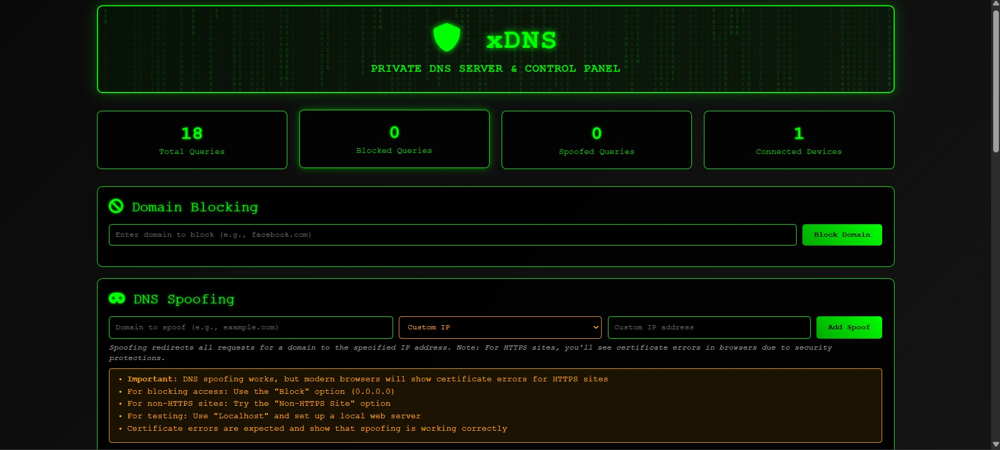
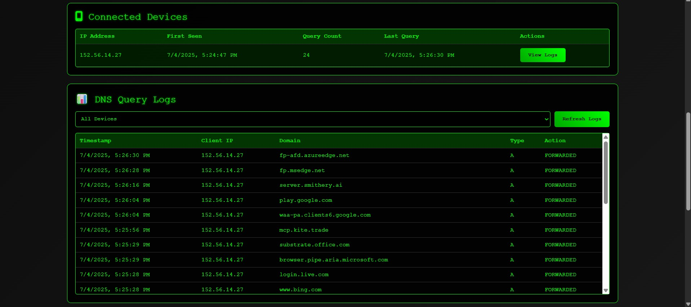
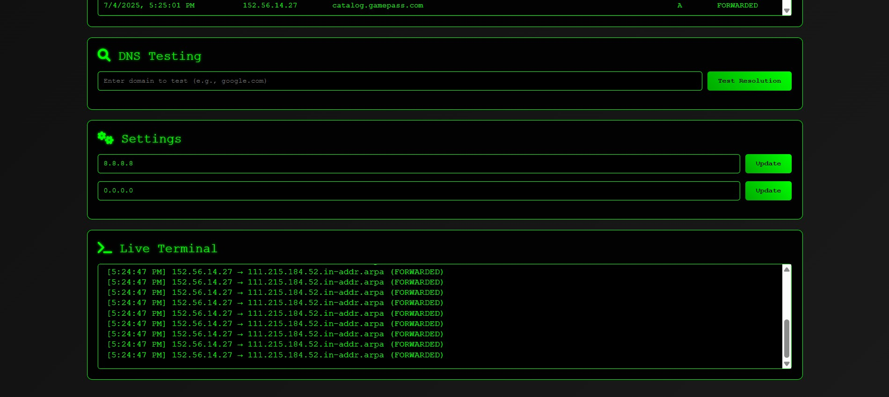

# xDNS - Private DNS Server & Control Panel

## 🛡️ Overview

xDNS is a private DNS server with an integrated control panel that provides complete control over your network's DNS traffic. It allows you to monitor, block, and redirect DNS requests with an intuitive user interface designed for both security professionals and privacy-conscious users.

## ✨ Features

- **🔍 DNS Monitoring**: Track all DNS queries on your network in real-time
- **🚫 Domain Blocking**: Block access to malicious or unwanted domains
- **🎭 DNS Spoofing**: Redirect domain requests to specified IP addresses
- **📱 Device Tracking**: Monitor all devices making DNS requests on your network
- **⚙️ Customizable Settings**: Configure upstream DNS servers and blocking behavior
- **💻 Live Terminal**: View DNS server logs in real-time

## 🔧 Use Cases

- **Network Security**: Block access to known malicious domains
- **Parental Controls**: Restrict access to inappropriate content
- **Privacy Enhancement**: Prevent tracking by redirecting analytics domains
- **Development & Testing**: Test applications by redirecting domains to local servers
- **Network Monitoring**: Track all DNS activity on your network

## 🖥️ Screenshots

### xDNS Interface

### DNS Query Logs

### Connected Devices & Live Terminal

## 🔒 Security Notice

xDNS is designed for use on networks you own or have permission to modify. Using DNS spoofing capabilities on unauthorized networks may violate laws and regulations.

## ⚠️ Availability

xDNS is currently a **closed-source project**. The source code is not publicly available. This repository contains only documentation and information about the project.

If you're interested in using xDNS for your organization or have questions about potential licensing, please reach out via the contact information below.

---

  
Developed by 💻 Siddharth Shinde

  
If you'd like to work with me, connect on LinkedIn: <a href="https://www.linkedin.com/in/sidinsearch/">linkedin.com/in/sidinsearch/</a>

